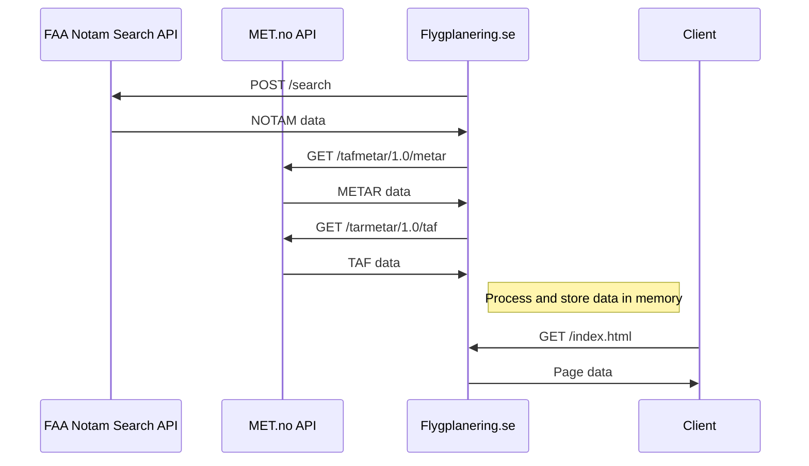

# flygplanering.se
ASP.NET Core web application for easy preflight preparations. Intended to be used by swedish PPL-pilots for self-briefing before VFR flights (Visual Flight Conditions)

Visit the live website: https://flygplanering.se

## Data sources

The information presented on the page is taken from three different data sources:

* **NSWC**  
  [LFV AROWeb](https://aro.lfv.se/)  
  *Swedish LFV (Luftfartsverket) is a state-owned enterprise that provides air traffic management and air navigation services. The data is taken directly from their self-briefing system by web scraping their AIS MET pages.*  
* **METAR/TAF**  
  [MET Norway](https://api.met.no/weatherapi/tafmetar/1.0/documentation)  
  *Norway's National Meteorological Institute provides a simple REST API for retrieving METAR and TAF for Swedish airports.*  
* **NOTAM**  
  [NOTAM Search (FAA)](https://notams.aim.faa.gov/notamSearch)  
  *The Federal Aviation Administration (FAA) provides a web interface for accessing digital airport NOTAMs. This system also includes a simple REST API that can be used to retrieve NOTAMs with a simple HTTP POST request; no authentication or API key is needed.*

## Diagram

## License

This repository is licensed with the [MIT](LICENSE) license

## Author

martensi (Simon Mårtensson)
